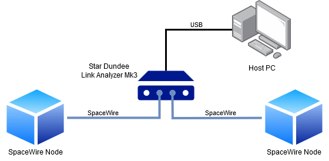

# SpaceWire Data Recorder

This software records bidirectional [SpaceWire](https://www.esa.int/Enabling_Support/Space_Engineering_Technology/Onboard_Computers_and_Data_Handling/SpaceWire) network traffic between two SpaceWire nodes, using a [STAR-Dundee SpaceWire Link Analyser Mk3](https://www.star-dundee.com/products/spacewire-link-analyser-mk3/) and the SpaceWire Link Analyser API.

For further information about SpaceWire, refer to the [ECSS-E-ST-50-12C Standard](https://ecss.nl/standard/ecss-e-st-50-12c-rev-1-spacewire-links-nodes-routers-and-networks-15-may-2019/).

## Key Features

- Non-intrusive monitoring of SpaceWire networks with 10-ns timestamp precision
- Configurable trigger events (time-codes/FCTs) and recording times
- Integration with Wireshark via custom Lua dissectors
- Kafka-based archiving into a database

## Motivation

This tool was developed for the [PLATO](https://www.dlr.de/en/pf/research-transfer/missions-and-projects/plato) space mission at the German Aerospace Center to ensure reliable communication between mission-critical sub-components.
It monitors and records SpaceWire network traffic between two nodes without affecting the data transfer to aid analysis and debugging of network communication using the proprietary PLATO protocol.
To achieve this, the Link Analyser is connected to both SpaceWire nodes and forwards the data traffic between them, while being able to simultaneously record incoming traffic from both devices.



There are 3 main use cases for this program:

- Writing the recorded data to a packet-based formatted hexdump, which can be imported by Wireshark
- Archiving the packet-based data log to a database by sending it via Kafka
- Save data in a raw event-based log and write it to a txt file

## How It Works

After being configured according to the arguments passed into the tool, the Link Analyser starts recording. Depending on the ``-f`` flag, it triggers upon receiving either a FCT control character or a time-code (see SpaceWire Standard) and continues to record data for the duration specified by the argument `SECONDS`.
Once the recording is completed, the Link Analyser transmits the logged traffic data to this application on the host PC. The maximum duration of the recording is limited by the internal storage of the Link Analyser and depends on the types of characters being recorded as well as the network activity.

Preceded by a header containing configuration and metadata, the recorded data will then be printed to console  from where it can be written into a text file using the '>' operator. The traffic data recorded before the trigger will only be printed within the 'pre-trigger time' specified by `-p MILLIS` to allow for inspection of the events leading up to the trigger.
If the verbose flag `-v` is set, only the event types recorded on both receivers and their timestamps will be printed in a readable format, enabling developers to quickly assess the network activity. Otherwise the events will be assembled into the full SpaceWire packets and written to console whenever a packet on one of the receivers is terminated or the end of recording is reached, in which case the packet will be marked as incomplete. The assembled packages are then printed as a formatted hexdump in order of completion.
If the option `-a 'TOPIC TEST_ID TEST_VERS IF_ID_IN IF_ID_OUT DB_VERS ASW_VERS'` is enabled, the packets are additionally archived in a database using Kafka messages.

### Hexdump For Wireshark

The primary purpose of this tool is to write the recorded SpaceWire traffic into a formatted hexdump, which can then be imported into Wireshark. With the use of custom Lua dissector scripts, it is then possible to directly read the contents of the proprietary PLATO protocol embedded into the SpaceWire data packets, making the debugging process significantly easier.

The hexdump consists of a header containing meta data relevant for the recording and the packet based recording of the data traffic. Each packet is preceded by a timestamp. The first line of data in a packet forms the 12-bit packet header.
Since the packets are only written when complete, they might not appear in strict chronological order, since a shorter packet from the other SpaceWire node might have been received in the meantime. If needed, the packets can be sorted by timestamps in Wireshark.

```
# Trigger timestamp:   2022-03-08T20:14:02.598964125
# Software version:    spw_data_rec v0.3.4

### Configuration
# Record duration:     5s
# PreTrig duration:    3000ms
# Trigger event:       Time-code
# Enable NULLs:        0
# Enable FCTs:         1
# Enable time-codes:   1
# Enable NChars:       1

### Link Analyser
# API version:         v5.01
# Device name:         FEE_1
# Serial number:       32190444
# Device version:      v1.01 edit 8
# Firmware version:    v1.05
# Build date:          19-01-10 14:43


I 2022-03-08T20:14:00.261377                    <Incoming Packet>
000000 50 F0 00 80 02 83 7F 9A 00 00 00 2E      <Header>
00000C 00 00 00 00 00 00 00 00
000014 00 00 00 00 07 7F 9B 00
...
00007C 00 00 00 00 00 00 00 00
000084 00 00 00 00 00 00 00 3B

O 2022-03-08T20:14:01.561410                    <Outgoing Packet>
000000 50 F0 00 18 02 82 7F 9A 00 01 00 49      <Header>
00000C 00 00 F0 00 00 00 00 47
000014 A7 56 A3 00 00 00 00 00
00001C 00 00 00 00 00 00 00 18

...
<empty line at end of file>
```

#### Timestamps

The packets in the hexdump are marked with an absolute timestamp of the format `"%FT%T.%f"` (e.g. 2022-03-14T13:07:25.598964125), although in some versions of Wireshark, only `"%FT%T."` is accepted to specify this format. The precision of the decimal seconds to be read by Wireshark is variable. The Link Analyser Mk3 is capable of measuring time with 100MHz clock rate resulting in a 10 nanosecond accuracy.

## Usage

### Arguments

`spw_data_rec [-f] [-v] [-a 'TOPIC TEST_ID TEST_VERS IF_ID_IN IF_ID_OUT DB_VERS ASW_VERS'] [-c EN_CHARS] [-p MILLIS] [-r RECV]  [--help] [--usage] SERIAL_NO SECONDS`

| Option | Argument  | Type    | Default  |Description                                                                                                                       |
| ------ | --------- | ------- |  ------- | --------------------------------------------------------------------------------------------------------------------------------- |
| **-f**     | none      | Flag    | disabled | Flag for using FCTs as the trigger event instead of time-codes.                                                                    |
| **-v**     | none      | Flag    | disabled | Flag for printing readable event based capture logs instead of packet based hexdumps.                                             |
| **-a**     | "TOPIC TEST_ID TEST_VERS IF_ID_IN IF_ID_OUT DB_VERS ASW_VERS" | string | none | Enables archiving the captured data to a database using Kafka. The arguments have to be passed as a space-separated string containing at least one character per argument. |
| **-c**     | EN_CHARS  | integer | 7 | Enables SpaceWire characters to be recorded by the LinkAnalyser. The integer input (0-15) is interpreted as a binary value with each bit serving as an enable flag for logging one type of character.<br>First bit (LSB) -> enable NChars<br>Second bit -> enable time-codes<br>Third bit -> enable FCTs<br>Fourth bit (MSB) -> enable NULL codes |
| **-p**     | MILLIS    | integer | 3000 | Determines the maximum time period (ms) before the trigger, for which recorded packets will be printed to the hexdump. |
| **-r**     | RECV      | char    | 'B' | Determines on which of its receivers the Link Analyser will wait for the trigger event ('A' or 'B').                             |
|    | SERIAL_NO | integer | none | The serial number of the Link Analyser recording the data traffic.                                                                |
|    | SECONDS   | double  | none | The duration in seconds to be recorded after the Link Analyser has been triggered.                                                |

### Dependencies

- STAR-Dundee SpaceWire Link Analyser API
- GCC Compiler
- JSON-C, librdkafka, and uuid libraries

### Building executable

A path to StarDundee's STAR-API and SpaceWire Link Analyser API needs to be provided to build the executable.

`gcc -Iinc -I<star-api include path> -I<spw_la_api include path> -I<librdkafka include path> -I<json-c include path> -L<star-api library path> -L<spw_la_api library path> -g src/*.c -lstar-api -lstar_conf_api_brick_mk2 -lspw_la_api -lrdkafka -luuid -ljson-c -o ./bin/spw_data_rec`

### Recording Data To Hexdump

The console output can simply be written to a file by using the `>` command line operator.

`spw_data_rec [options] <serial number> <seconds> > hexdump.txt`

### Importing Hexdump Into Wireshark

PCAP is the file format of packet captures in Wireshark.

`text2pcap -D -t "%FT%T." -T 0,59274 hexdump.txt hexdump.pcap`

`wireshark -t r hexdump.pcap`

### Archiving Hexdump With Kafka

`spw_data_rec -a "<topic_name> <test_id> <test_version> <interface_id_in> <interface_id_out> <database_version> <asw_version>" <serial number> <seconds>`
